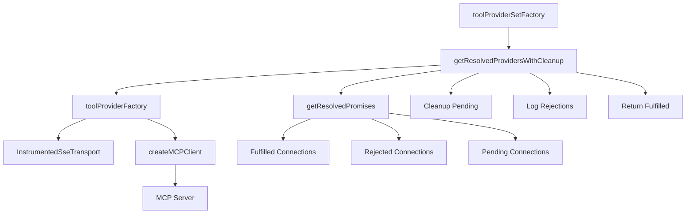

# Tool Provider Factory

## Overview

The `toolProviderFactory` module provides factory functions for creating and managing Model Context Protocol (MCP) client connections. It handles connection timeouts, error recovery, and resource cleanup for MCP servers that provide AI tools.

## Key Features

- **Resilient Connection Management**: Handles MCP server connections with timeout and error recovery
- **Resource Cleanup**: Automatically disposes of failed or timed-out connections
- **Tool Filtering**: Supports read-only and read-write tool access modes
- **Concurrent Connection Handling**: Efficiently manages multiple MCP server connections
- **Comprehensive Error Logging**: Detailed error tracking and reporting

## Architecture



## API Reference

### `toolProviderFactory(options: ToolProviderFactoryOptions): Promise<ConnectableToolProvider>`

Creates a single MCP client connection.

#### Parameters

- `options` - Configuration options for the MCP connection
  - `url: string` - The MCP server URL
  - `headers?: Record<string, string>` - Optional HTTP headers
  - `allowWrite?: boolean` - Whether to include write-access tools

#### Returns

`Promise<ConnectableToolProvider>` - A connected tool provider with the following interface:

```typescript
interface ConnectableToolProvider {
  get_mcpClient(): MCPClient;
  get_isConnected(): boolean;
  get tools(): ToolSet;
  dispose(): Promise<void>;
  connect(options: { allowWrite?: boolean }): Promise<ConnectableToolProvider>;
}
```

#### Example Usage

```typescript
const provider = await toolProviderFactory({
  url: 'https://mcp-server.example.com/api',
  headers: { Authorization: 'Bearer token' },
  allowWrite: false,
});

// Use the provider
const tools = provider.tools;
const isConnected = provider.get_isConnected();

// Clean up when done
await provider.dispose();
```

#### Error Handling

The factory implements graceful degradation:

- Returns a stub provider if connection fails
- Logs connection errors without throwing
- Provides empty tool set for failed connections

### `toolProviderSetFactory(providers: Array<ToolProviderFactoryOptions>, timeoutMs?: number): Promise<ToolProviderSet>`

Creates and manages multiple MCP client connections concurrently.

#### Parameters

- `providers: Array<ToolProviderFactoryOptions>` - Array of provider configurations
- `timeoutMs: number = 60000` - Timeout in milliseconds for each connection

#### Returns

`Promise<ToolProviderSet>` - A collection of connected providers:

```typescript
interface ToolProviderSet {
  providers: ConnectableToolProvider[];
  get tools(): ToolSet;
  dispose(): Promise<void>;
}
```

#### Example Usage

```typescript
const providerSet = await toolProviderSetFactory(
  [
    { url: 'https://server1.example.com/api', allowWrite: false },
    { url: 'https://server2.example.com/api', allowWrite: true },
    { url: 'https://server3.example.com/api' },
  ],
  30000,
); // 30 second timeout

// Get all available tools from all connected providers
const allTools = providerSet.tools();

// Clean up all providers
await providerSet.dispose();
```

### `getResolvedProvidersWithCleanup(promises: Promise<ConnectableToolProvider>[], timeoutMs?: number): Promise<ConnectableToolProvider[]>`

Internal helper function that categorizes promise results and handles cleanup.

#### Parameters

- `promises: Promise<ConnectableToolProvider>[]` - Array of provider promises
- `timeoutMs: number = 60000` - Timeout for promise resolution

#### Returns

`Promise<ConnectableToolProvider[]>` - Array of successfully connected providers

#### Behavior

1. **Categorizes Results**: Uses `getResolvedPromises` to separate fulfilled, rejected, and pending promises
2. **Cleanup Pending**: Sets up cleanup hooks for promises that are still pending after timeout
3. **Error Logging**: Logs rejected connections using `LoggedError.isTurtlesAllTheWayDownBaby`
4. **Resource Management**: Ensures proper disposal of timed-out connections

## Connection States

### Successful Connection

- MCP client established
- Tools available
- Provider ready for use

### Failed Connection

- Returns stub provider
- Empty tool set
- Error logged but not thrown

### Timed-Out Connection

- Moved to cleanup queue
- Resources disposed asynchronously
- Does not block other connections

## Error Handling Strategy

The module uses a multi-layered error handling approach:

### 1. Connection Level

```typescript
try {
  // Create MCP client
} catch (error) {
  // Return stub provider
  // Log error
  // Continue gracefully
}
```

### 2. Transport Level

```typescript
onerror: (error: unknown) => {
  log((l) => l.error('MCP Client SSE Error:', error));
  return assistantErrorMessage;
};
```

### 3. Client Level

```typescript
onUncaughtError: (error) => {
  log((l) => l.error('MCP Client Uncaught Error:', error));
  return assistantErrorMessage;
};
```

### 4. Cleanup Level

```typescript
provider.dispose().catch((e) => {
  log((l) => l.error('Error disposing provider:', e));
});
```

## Tool Filtering

The factory supports two access modes:

### Read-Only Mode (`allowWrite: false`)

```typescript
// Filters out tools with "Write access" in description
const tools = Object.entries(allTools).reduce((acc, [toolName, tool]) => {
  if ((tool.description?.indexOf('Write access') ?? -1) === -1) {
    acc[toolName] = tool;
  }
  return acc;
}, {} as ToolSet);
```

### Read-Write Mode (`allowWrite: true`)

```typescript
// Includes all available tools
const tools = allTools;
```

## Resource Management

### Automatic Cleanup

- Pending connections are automatically disposed after timeout
- Failed connections don't leak resources
- Graceful shutdown on provider disposal

### Manual Cleanup

```typescript
// Single provider
await provider.dispose();

// Provider set
await providerSet.dispose(); // Waits max 15 seconds for all disposals
```

## Logging and Monitoring

### Debug Information

- Connection establishment counts
- Timeout and error statistics
- Resource disposal events

### Error Tracking

- Failed connection details
- Cleanup errors
- Transport-level errors

### Example Log Output

```
DEBUG: MCP toolProviderFactory resolved; 3 connections established.
ERROR: Some MCP clients failed to connect or returned errors
ERROR: Error disposing provider after rejection: ConnectionError
```

## Dependencies

- `@/lib/logger` - Logging infrastructure
- `@/lib/react-util` - Utility functions including `getResolvedPromises`
- `ai` - AI SDK for MCP client creation
- `./traceable-transport` - Instrumented SSE transport
- `./types` - Type definitions

## Type Definitions

### Core Types

```typescript
interface ToolProviderFactoryOptions {
  url: string;
  headers?: Record<string, string>;
  allowWrite?: boolean;
}

interface ConnectableToolProvider {
  get_mcpClient(): MCPClient;
  get_isConnected(): boolean;
  get tools(): ToolSet;
  dispose(): Promise<void>;
  connect(options: { allowWrite?: boolean }): Promise<ConnectableToolProvider>;
}

interface ToolProviderSet {
  providers: ConnectableToolProvider[];
  get tools(): ToolSet;
  dispose(): Promise<void>;
}
```

## Best Practices

### 1. Connection Management

- Always dispose providers when done
- Use appropriate timeouts for your use case
- Handle connection failures gracefully

### 2. Error Handling

- Don't rely on all connections succeeding
- Check provider connection status before use
- Log errors for debugging

### 3. Resource Usage

- Use read-only mode when write access isn't needed
- Set reasonable timeouts to avoid hanging
- Monitor connection health

### 4. Performance

- Connect to multiple providers concurrently
- Use connection pooling for repeated access
- Clean up unused connections promptly

## Testing

The factory includes comprehensive error handling that makes it suitable for:

- Unit testing with mock MCP servers
- Integration testing with real MCP endpoints
- Load testing with multiple concurrent connections

## Security Considerations

- **Header Management**: Safely handles authentication headers
- **URL Validation**: Accepts any URL format for flexibility
- **Error Exposure**: Logs errors without exposing sensitive data
- **Resource Isolation**: Failed connections don't affect successful ones

## Migration Guide

When upgrading from previous versions:

1. **Timeout Parameter**: The timeout parameter is now optional with a 60-second default
2. **Error Handling**: Errors are now logged instead of thrown
3. **Resource Cleanup**: Automatic cleanup is now handled internally
4. **Tool Filtering**: The `allowWrite` parameter now properly filters tools

## Troubleshooting

### Common Issues

1. **Connection Timeouts**

   - Increase `timeoutMs` parameter
   - Check MCP server responsiveness
   - Verify network connectivity

2. **Empty Tool Sets**

   - Check MCP server tool availability
   - Verify `allowWrite` parameter setting
   - Review server-side tool filtering

3. **Resource Leaks**

   - Ensure `dispose()` is called
   - Check for unhandled promise rejections
   - Monitor connection cleanup logs

4. **Authentication Failures**
   - Verify header format and values
   - Check server-side authentication logs
   - Ensure proper authorization setup
