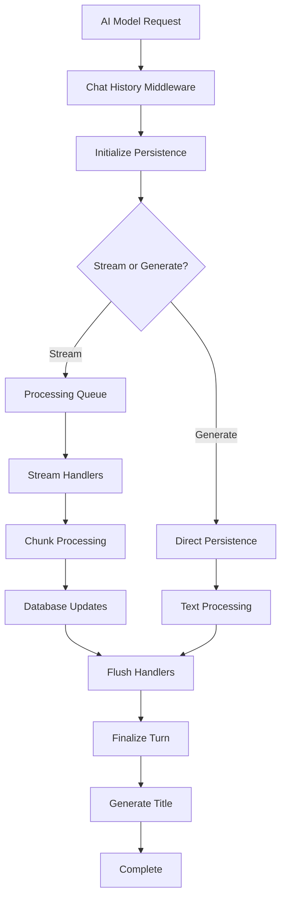

# Chat History Middleware

A comprehensive middleware system for managing AI chat conversation persistence, streaming, and state m### 8. OpenTelemetry Instrumentation (`instrumentation.ts`)
Provides comprehensive observability for the chat history middleware system:

```typescript
import { instrumentFlushOperation, recordQueueOperation } from '@/lib/ai/middleware/chat-history';

// Instrument flush operations
const result = await instrumentFlushOperation(flushContext, async () => {
  return await handleFlush(context, config);
});

// Record queue metrics
recordQueueOperation('enqueue', true, queueSize);
```

**Capabilities:**
- Distributed tracing with OpenTelemetry spans
- Performance metrics collection (histograms, counters)
- Error tracking and attribution
- Queue operation monitoring
- Flush operation observability

### 9. Type Definitions (`types.ts`)he NoEducation platform.

## Overview

The Chat History Middleware provides robust, transparent persistence of AI conversations with support for both streaming and direct text generation modes. It maintains conversation order, handles errors gracefully, and ensures data integrity while being completely transparent to the user experience.

## Features

- **🔄 Streaming Support**: Real-time persistence of streaming AI responses
- **📦 Batch Processing**: Efficient handling of non-streaming text generation
- **🎯 FIFO Ordering**: Maintains correct message sequence even with async operations
- **🛡️ Error Resilience**: Graceful degradation when persistence fails
- **📊 Performance Metrics**: Built-in monitoring and analytics
- **� OpenTelemetry Integration**: Comprehensive observability with OTEL instrumentation
- **�🗄️ Database Integration**: PostgreSQL with Drizzle ORM
- **🏷️ Auto-Titling**: Intelligent chat title generation
- **🔧 Configurable**: Flexible configuration options

## Architecture



## Core Components

### 1. Main Middleware (`index.ts`)
The primary entry point that orchestrates the entire chat history pipeline with built-in instrumentation:

```typescript
import { createChatHistoryMiddleware } from '@/lib/ai/middleware/chat-history';

const chatHistoryMiddleware = createChatHistoryMiddleware({
  // Configuration context
});

// Use with your AI model
const model = wrapModel(aiModelFactory('hifi'), [chatHistoryMiddleware]);
```

**Key Responsibilities:**
- Initialize message persistence for each conversation turn
- Coordinate streaming vs. generation modes
- Maintain local state (message order, accumulated text)
- Handle transparent error recovery
- Automatic OpenTelemetry instrumentation

### 2. Processing Queue (`processing-queue.ts`)
Ensures FIFO ordering of stream chunks during real-time processing:

```typescript
const queue = new ProcessingQueue();

// Chunks processed in order regardless of completion time
await queue.enqueue(chunk1, context1);
await queue.enqueue(chunk2, context2);
await queue.enqueue(chunk3, context3);
```

**Features:**
- Maintains strict FIFO ordering
- Handles async database operations
- Provides error isolation per chunk
- Supports concurrent processing with ordered results

### 3. Stream Handlers (`stream-handlers.ts`)
Specialized processors for different types of streaming content:

- **Text Delta Handler**: Accumulates incremental text updates
- **Tool Call Handler**: Processes AI tool invocations  
- **Tool Result Handler**: Handles tool execution results
- **Finish Handler**: Manages stream completion
- **Error Handler**: Processes error conditions

```typescript
// Automatic routing based on chunk type
const result = await processStreamChunk(chunk, context);
```

### 4. Message Persistence (`message-persistence.ts`)
Shared utilities for database operations across all modes:

```typescript
// Initialize persistence
const init = await safeInitializeMessagePersistence(context, params);

// Complete persistence
await safeCompleteMessagePersistence({
  chatId: 'chat-123',
  generatedText: 'AI response...',
  startTime: Date.now()
});
```

**Capabilities:**
- Safe initialization with error handling
- Transactional database operations
- Automatic chat/turn/message creation
- Graceful failure recovery

### 5. Flush Handlers (`flush-handlers.ts`)
Manages conversation turn completion and finalization:

```typescript
const result = await handleFlush(flushContext, config);
```

**Operations:**
- Finalize assistant messages
- Update turn completion status
- Generate intelligent chat titles
- Calculate performance metrics
- Handle cleanup operations

### 6. Import Utilities (`import-incoming-message.ts`)
Handles the import and persistence of user messages:

```typescript
const messageId = await importIncomingMessage(
  transaction,
  chatId,
  turnId,
  messageOrder,
  userMessage
);
```

### 7. Type Definitions (`types.ts`)
Comprehensive TypeScript interfaces for the entire system:

- `ChatHistoryContext`: Main configuration interface
- `StreamHandlerContext`: Runtime processing context
- `StreamHandlerResult`: Processing operation results
- `QueuedTask`: Asynchronous task management
- `FlushContext`: Turn completion context
- `FlushResult`: Completion operation results
- `FlushConfig`: System behavior configuration

## Quick Start

### 1. Basic Setup

```typescript
import { createChatHistoryMiddleware } from '@/lib/ai/middleware/chat-history';
import { aiModelFactory } from '@/lib/ai/aiModelFactory';

// Create middleware with configuration
const chatHistoryMiddleware = createChatHistoryMiddleware({
  // Your chat history context
});

// Apply to your AI model
const model = wrapModel(aiModelFactory('hifi'), [chatHistoryMiddleware]);
```

### 2. Streaming Example

```typescript
// Streaming will be automatically persisted
const { textStream } = await streamText({
  model,
  messages: [
    { role: 'user', content: 'Hello!' }
  ]
});

// Stream is transparently persisted as it flows
for await (const textPart of textStream) {
  console.log(textPart);
}
```

### 3. Direct Generation Example

```typescript
// Direct generation is batched and persisted
const { text } = await generateText({
  model,
  messages: [
    { role: 'user', content: 'What is TypeScript?' }
  ]
});

console.log(text); // Automatically persisted
```

## Configuration

### FlushConfig Options

```typescript
const config: FlushConfig = {
  // Title generation
  autoGenerateTitle: true,
  maxTitleLength: 100,
  titleWordCount: 6,
  
  // Performance settings
  flushIntervalMs: 1000,
  timeoutMs: 5000,
  batchSize: 50,
  
  // Reliability
  retryAttempts: 3,
  compressionEnabled: true,
  
  // Monitoring
  enableMetrics: true,
  verboseLogging: false
};
```

### Environment-Specific Configurations

```typescript
// Production configuration
const prodConfig: FlushConfig = {
  autoGenerateTitle: true,
  maxTitleLength: 100,
  titleWordCount: 8,
  flushIntervalMs: 1000,
  timeoutMs: 5000,
  enableMetrics: true,
  retryAttempts: 3,
  compressionEnabled: true
};

// Development configuration
const devConfig: FlushConfig = {
  autoGenerateTitle: true,
  maxTitleLength: 150,
  titleWordCount: 10,
  flushIntervalMs: 500,
  timeoutMs: 10000,
  enableMetrics: true,
  verboseLogging: true,
  retryAttempts: 1
};
```

## Database Schema

The middleware integrates with the following database tables:

### Core Tables
- **`chats`**: Conversation containers with titles and metadata
- **`chatTurns`**: Individual conversation exchanges  
- **`chatMessages`**: Specific messages (user/assistant)
- **`tokenUsage`**: AI model usage tracking and metrics

### Key Relationships
```sql
chats (1) -> (many) chatTurns
chatTurns (1) -> (many) chatMessages
chatMessages (1) -> (1) tokenUsage
```

## Error Handling

The middleware implements comprehensive error handling:

### 1. Graceful Degradation
```typescript
// If persistence fails, chat continues normally
const persistenceInit = await safeInitializeMessagePersistence(context, params);
if (!persistenceInit) {
  // Fall back to original stream/generation
  return doStream(); // or doGenerate()
}
```

### 2. Error Isolation
```typescript
// Individual chunk errors don't stop the stream
processingQueue.enqueue(chunk, context)
  .catch((error) => {
    log((l) => l.error('Chunk processing failed', { error }));
    // Stream continues normally
  });
```

### 3. Transaction Safety
```typescript
// Database operations are wrapped in transactions
await drizDb.transaction(async (tx) => {
  // All operations succeed or all fail
  await importIncomingMessage(tx, ...);
  await finalizeAssistantMessage(tx, ...);
});
```

## Performance Optimizations

### 1. Asynchronous Processing
- Non-blocking stream processing
- Concurrent database operations
- Background persistence operations

### 2. Batch Operations
- Efficient database batching
- Reduced I/O overhead
- Optimized transaction management

### 3. Memory Management
- Streaming chunk processing
- Minimal memory footprint
- Automatic cleanup

### 4. Caching Strategies
- Message order caching
- Context state preservation
- Reduced database queries

## Monitoring and Analytics

### Built-in OpenTelemetry Metrics
The middleware automatically collects comprehensive metrics:

- **Flush Operation Histogram**: `chat_history_flush_duration` - Duration of flush operations in milliseconds
- **Flush Operation Counter**: `chat_history_flush_operations_total` - Total flush operations with success/error labels
- **Stream Chunk Counter**: `chat_history_stream_chunks_total` - Stream chunks processed by type
- **Text Length Histogram**: `chat_history_text_length` - Generated text length distribution
- **Error Counter**: `chat_history_errors_total` - Errors by operation type and category
- **Queue Operation Counter**: `chat_history_queue_operations_total` - Queue operations (enqueue/process/complete)
- **Queue Size Gauge**: `chat_history_queue_size` - Current processing queue size

### Built-in Spans and Traces
- **`chat_history.flush`**: Complete flush operation tracing
- **`chat_history.stream_chunk`**: Individual chunk processing
- **`chat_history.middleware_init`**: Initialization tracing

### Custom Analytics
```typescript
// Access flush result metrics
const result = await handleFlush(context, config);
console.log(result.processingTimeMs); // Processing duration
console.log(result.textLength);       // Response length
console.log(result.metadata);         // Custom metrics

// Manual instrumentation
import { instrumentFlushOperation } from '@/lib/ai/middleware/chat-history';

const result = await instrumentFlushOperation(context, async () => {
  // Your custom flush logic
  return customFlushOperation();
});
```

### Error Attribution
Enhanced error tracking with chat context:

```typescript
import { createChatHistoryError } from '@/lib/ai/middleware/chat-history';

// Errors include structured chat context
throw createChatHistoryError(
  'Operation failed',
  { chatId: 'chat-123', turnId: 1, messageId: 42 },
  originalError
);
```

## Testing

### Unit Tests
Located in `__tests__/lib/ai/middleware/chat-history/`:
- Individual component testing
- Mock database operations
- Error scenario validation
- Performance benchmarking

### Integration Tests
- Full middleware pipeline testing
- Database interaction validation
- Streaming workflow verification
- Error recovery testing

### Test Utilities
```typescript
// Test helpers available
import { createTestChatContext } from '__tests__/test-utils/chat-helpers';

const testContext = createTestChatContext({
  chatId: 'test-chat-123'
});
```

## Common Patterns

### 1. Custom Stream Processing
```typescript
// Add custom chunk processing
const customHandler = async (chunk, context) => {
  // Your custom logic
  const result = await processStreamChunk(chunk, context);
  // Additional processing
  return result;
};
```

### 2. Error Recovery
```typescript
// Implement custom error recovery
const middleware = createChatHistoryMiddleware({
  onError: (error, context) => {
    // Custom error handling
    console.error('Chat history error:', error);
    // Return recovery action
  }
});
```

### 3. Performance Monitoring
```typescript
// Monitor performance metrics
const startTime = Date.now();
const result = await handleFlush(context);
const duration = Date.now() - startTime;

console.log(`Flush completed in ${duration}ms`);
```

## Troubleshooting

### Common Issues

1. **Stream Chunks Out of Order**
   - Solution: Verify ProcessingQueue is being used
   - Check: FIFO ordering in queue implementation

2. **Database Connection Errors**
   - Solution: Implement retry logic in flush configuration
   - Check: Database connection pool settings

3. **Memory Leaks in Streaming**
   - Solution: Ensure proper cleanup in transform streams
   - Check: Processing queue cleanup procedures

4. **Title Generation Failures**
   - Solution: Configure fallback title generation
   - Check: AI model availability for title generation

### Debug Logging
```typescript
// Enable verbose logging
const config: FlushConfig = {
  verboseLogging: true,
  enableMetrics: true
};

// Monitor specific operations
log((l) => l.debug('Chat history operation', { 
  operation: 'flush',
  chatId,
  duration: processingTimeMs 
}));
```

## Contributing

### Development Setup
1. Install dependencies: `yarn install`
2. Run tests: `yarn test lib/ai/middleware/chat-history`
3. Type checking: `yarn tsc --noEmit`
4. Linting: `yarn lint`

### Code Style
- Follow existing TypeScript patterns
- Comprehensive JSDoc documentation
- Error handling for all async operations
- Performance considerations for streaming

### Testing Requirements
- Unit tests for all new functions
- Integration tests for middleware changes
- Error scenario coverage
- Performance regression testing

## License

This chat history middleware is part of the NoEducation platform and follows the project's licensing terms.

---

For more information, see the individual module documentation or the main project README.
