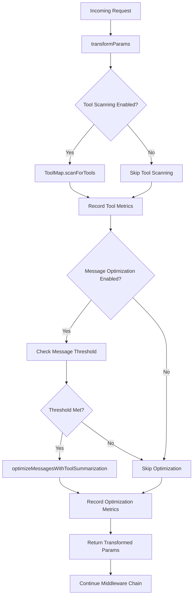

# Tool Optimizing Middleware

Enterprise-grade middleware for AI tool optimization that provides intelligent tool discovery and message optimization capabilities for language model interactions.

## Overview

The Tool Optimizing Middleware is designed to enhance AI model interactions by:

1. **Tool Discovery**: Automatically scans and registers new tools using ToolMap's `scanForTools` method
2. **Message Optimization**: Applies intelligent message summarization using tool-based optimization
3. **Performance Monitoring**: Comprehensive OpenTelemetry metrics for observability
4. **Robustness**: Error-resistant design that maintains functionality even when optimizations fail

## Key Features

### Tool Scanning

- Automatically discovers new tool definitions from incoming requests
- Registers tools in the centralized ToolMap for future use
- Tracks metrics on tool discovery and registration success rates
- Handles both single tools and tool arrays

### Message Optimization

- Applies `optimizeMessagesWithToolSummarization` for large message histories
- Configurable message threshold to trigger optimization
- Preserves conversation context while reducing token usage
- Supports both text generation and streaming scenarios

### Observability

- OpenTelemetry metrics for tool scanning, optimization, and performance
- Detailed logging for debugging and monitoring
- User and chat session tracking for analytics
- Error tracking and fallback behavior monitoring

## Configuration

```typescript
interface ToolOptimizingMiddlewareConfig {
  userId?: string; // User ID for tracking and metrics
  chatHistoryId?: string; // Chat session ID for context tracking
  enableMessageOptimization?: boolean; // Enable message optimization (default: true)
  optimizationThreshold?: number; // Min messages to trigger optimization (default: 10)
  enableToolScanning?: boolean; // Enable tool discovery (default: true)
}
```

## Usage

### Basic Usage

```typescript
import { createToolOptimizingMiddleware } from '/lib/ai/middleware/tool-optimizing-middleware';
import { aiModelFactory } from '/lib/ai/aiModelFactory';
import { wrapLanguageModel } from 'ai';

// Create middleware with default configuration
const toolOptimizer = createToolOptimizingMiddleware();

// Apply to language model
const model = wrapLanguageModel({
  model: aiModelFactory('hifi'),
  middleware: [toolOptimizer],
});
```

### Return shapes and wrapper-mode behavior (important for custom middleware)

When this middleware runs in front of higher-level helpers (e.g., `generateText`, `streamText`, `generateObject`, `streamObject`), it operates in "wrapper-mode" to preserve compatibility with downstream middleware:

- For non-`generate` types, the middleware returns an object shaped like:
  - `{ type, params, ...params }` — the original/transformed `params` are provided as a nested property and also mirrored at the top-level for convenience (e.g., `messages`, `prompt`, `tools`, `inputFormat`, `mode`).
  - `model` is normalized to a string modelId at the top-level even if the incoming value was an object.
- For `generate` type, the middleware returns a standard `LanguageModelV2CallOptions` object (no wrapper), suitable for low-level calls.
- On optimization errors in wrapper-mode, the middleware preserves structure by returning exactly `{ type, params }` (without top-level mirroring). This makes error handling explicit and avoids ambiguous partial states.

Tip for custom middleware authors: if you expect wrapper-mode, access fields via `params.<field>` to avoid ambiguity, or safely prefer top-level fields when present.

### Advanced Configuration

```typescript
import { createToolOptimizingMiddleware } from '/lib/ai/middleware/tool-optimizing-middleware';

const toolOptimizer = createToolOptimizingMiddleware({
  userId: 'user-123',
  chatHistoryId: 'chat-session-456',
  enableMessageOptimization: true,
  optimizationThreshold: 15, // Wait for 15+ messages before optimizing
  enableToolScanning: true,
});

// Use in middleware stack
const model = wrapLanguageModel({
  model: aiModelFactory('hifi'),
  middleware: [
    chatHistoryMiddleware, // Chat history persistence
    toolOptimizer, // Tool optimization (this middleware)
    rateLimitMiddleware, // Rate limiting
  ],
});
```

### Integration with Chat Applications

```typescript
// In your chat route or service
import { createToolOptimizingMiddleware } from '/lib/ai/middleware/tool-optimizing-middleware';

export async function POST(req: Request) {
  const { messages, userId, chatId } = await req.json();

  const toolOptimizer = createToolOptimizingMiddleware({
    userId,
    chatHistoryId: chatId,
    enableMessageOptimization: messages.length > 8, // Dynamic threshold
  });

  const model = wrapLanguageModel({
    model: aiModelFactory('hifi'),
    middleware: [toolOptimizer],
  });

  const result = await generateText({
    model,
    messages,
    tools: myToolDefinitions,
  });

  return result;
}
```

## Architecture

### Middleware Flow



### Tool Discovery Process

1. **Tool Detection**: Middleware receives tools parameter from language model call
2. **ToolMap Query**: Checks existing ToolMap for unknown tools
3. **Database Integration**: New tools are persisted to `chat_tool` table
4. **Cache Update**: ToolMap cache is updated with new tool definitions
5. **Metrics Recording**: Success/failure metrics are recorded

### Message Optimization Process

1. **Threshold Check**: Verifies message count meets optimization threshold
2. **Context Analysis**: Analyzes conversation history for optimization opportunities
3. **Tool Summarization**: Applies AI-powered summarization to completed tool sequences
4. **Context Preservation**: Maintains recent user interactions while compressing older content
5. **Token Reduction**: Achieves significant token savings while preserving conversation flow

## OpenTelemetry Metrics

### Counters

- `ai_tool_optimization_middleware_total`: Total middleware invocations
- `ai_tool_scanning_total`: Total tool scanning operations
- `ai_message_optimization_enabled_total`: Total message optimizations applied

### Histograms

- `ai_tool_optimization_middleware_duration_ms`: Processing duration
- `ai_new_tools_found_count`: Distribution of newly discovered tools
- `ai_message_optimization_enabled_total`: Optimization application frequency

### Attributes

All metrics include contextual attributes:

- `type`: Operation type (`generateText`, `streamText`, etc.)
- `user_id`: Hashed user identifier for privacy
- `chat_id`: Chat session identifier
- `model`: Model identifier used
- `optimization_applied`: Boolean indicating if optimization was applied
- `new_tools_found`: Count of newly discovered tools

## Error Handling

The middleware implements robust error handling:

### Tool Scanning Errors

- Failed tool scanning does not interrupt request processing
- Errors are logged with full context for debugging
- Metrics track scanning failures separately

### Message Optimization Errors

- Optimization failures fall back to original message set
- Conversation flow is never interrupted by optimization errors
- Detailed error logging helps identify optimization issues

### General Resilience

- All operations are wrapped in try-catch blocks
- Middleware always returns valid parameters, even on complete failure
- Graceful degradation ensures user experience is maintained

## Performance Considerations

### Tool Scanning Performance

- ToolMap maintains in-memory caches for fast lookups
- Database writes are asynchronous and don't block request processing
- Duplicate tool detection prevents unnecessary database operations

### Message Optimization Performance

- Optimization is applied selectively based on configurable thresholds
- LLM summarization uses efficient "lofi" models to minimize latency
- Caching prevents redundant summarization of identical tool sequences

### Memory Usage

- ToolMap uses efficient hash-based lookups
- Message optimization processes data in streaming fashion where possible
- Metrics collection uses minimal memory overhead

## Testing

Comprehensive test coverage includes:

### Unit Tests

- Tool scanning functionality with mock ToolMap
- Message optimization with various message configurations
- Error handling and fallback behavior
- Metrics recording and validation

### Integration Tests

- End-to-end middleware functionality
- Database integration for tool persistence
- Performance impact measurement
- Multi-middleware stack compatibility

### Load Tests

- High-volume tool discovery scenarios
- Large message history optimization
- Concurrent user session handling
- Memory usage under load

## Best Practices

### Configuration

- Set appropriate optimization thresholds based on your use case
- Enable both tool scanning and optimization for maximum benefit
- Provide user and chat IDs for better observability

### Monitoring

- Monitor tool discovery rates to understand user behavior
- Track optimization effectiveness through token reduction metrics
- Alert on error rates or performance degradation

### Development

- Test middleware in isolation before adding to production stacks
- Validate tool definitions before relying on automatic scanning
- Monitor memory usage in long-running chat sessions

## Migration Guide

### From Manual Tool Management

Replace manual tool registration:

```typescript
// Before
const toolMap = await ToolMap.getInstance();
await toolMap.scanForTools(myTools);
const model = aiModelFactory('hifi');

// After
const model = wrapLanguageModel({
  model: aiModelFactory('hifi'),
  middleware: [createToolOptimizingMiddleware()],
});
```

### From Manual Message Optimization

Replace manual optimization calls:

```typescript
// Before
const optimizedMessages = await optimizeMessagesWithToolSummarization(
  messages,
  'hifi',
  userId,
  chatId,
);
const result = await generateText({ model, messages: optimizedMessages });

// After
const model = wrapLanguageModel({
  model: aiModelFactory('hifi'),
  middleware: [
    createToolOptimizingMiddleware({ userId, chatHistoryId: chatId }),
  ],
});
const result = await generateText({ model, messages }); // Automatic optimization
```

## Troubleshooting

### Tool Scanning Issues

- **Tools not being registered**: Check ToolMap database connectivity
- **Duplicate tool errors**: Verify tool name uniqueness
- **Performance issues**: Monitor tool scanning metrics

### Message Optimization Issues

- **Optimization not applied**: Check message count vs threshold
- **Context loss**: Verify optimization preserves recent user interactions
- **Performance impact**: Monitor optimization duration metrics

### General Issues

- **Middleware not executing**: Verify middleware registration order
- **Metrics not appearing**: Check OpenTelemetry configuration
- **Memory leaks**: Monitor ToolMap cache size and growth

## Contributing

When contributing to the Tool Optimizing Middleware:

1. **Testing**: Add comprehensive tests for new functionality
2. **Metrics**: Include OpenTelemetry metrics for new operations
3. **Documentation**: Update this README for new features
4. **Error Handling**: Implement robust error handling and fallback behavior
5. **Performance**: Consider performance impact of new features

## License

This middleware is part of the NoEducation web-ui project and follows the same licensing terms.
