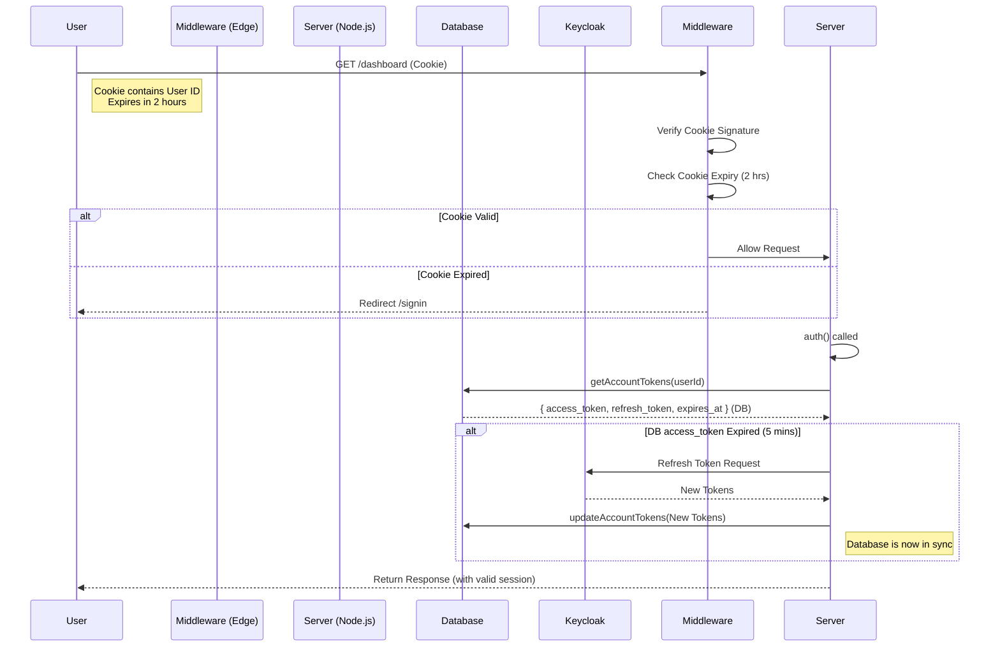

# Authentication Architecture: JWT & Session Callbacks

This document outlines the architecture used to manage authentication sessions, token persistence, and refreshes. This architecture is designed to solve specific challenges with the **Next.js Edge Runtime** (used by Middleware) while maintaining secure and fresh access tokens for server-side operations.

## Core Design Philosophy

> **"Session Identity is Decoupled from Token Freshness"**

We separate the concept of a "User Session" (controlled by the browser cookie) from the "Access Token" (controlled by the OAuth Provider/Keycloak).

1. **The JWT (Cookie)**: Represents the _User's Session_. It is long-lived (e.g., 2 hours). It contains **Identity** (User ID) but **NO Tokens**.
2. **The Database**: acts as the secure vault. It stores the _Access & Refresh Tokens_.
3. **The Session Callback**: acts as the _Token Vending Machine_. It retrieves tokens from the DB, refreshes them if needed, and hands them to the application.

## 1. The JWT Callback (`lib/auth/jwt.ts`)

**Runtime:** Edge (Middleware) & Server (Node.js)

The `jwt` callback is the first line of defense. It creates the token stored in the HTTP-only cookie.

- **Responsibility**: Establish Identity & Session Lifespan.
- **Behavior**:
  - **On Sign-In**: Copies `user.id` and `user.account_id` to the token.
  - **Cookie Storage**: It does **NOT** store `access_token` or `refresh_token`. This keeps the cookie small and secure.
  - **Expiration**: It sets `expires_at` to a long duration (e.g., 2 hours).
- **Why?**:
  - Middleware running on the Edge cannot easily write to the database.
  - If Middleware tries to refresh a token, it might fail to save the new token, leading to a "Refresh Loop" or "Half-Open" state.
  - By treating the Session as "Valid for 2 Hours" regardless of the Access Token's 5-minute expiry, Middleware lets the request pass through to the Server.

## 2. The Session Callback (`lib/auth/session.ts`)

**Runtime:** Server-Only (Node.js)

The `session` callback runs whenever `auth()` is called in a Server Component or Route Handler. This is where the magic happens.

- **Responsibility**: Provide Valid Access Tokens.
- **Behavior**:
  - **Fetch**: It uses `getAccountTokens(userId)` to fetch the _real_ `access_token` and `refresh_token` from the database.
  - **Check**: It checks if the `access_token` from the DB is expired (typically 5 minutes).
  - **Refresh**:
    - If expired, it calls Keycloak to refresh the token.
    - **CRITICAL**: It immediately saves the new tokens back to the Database using `updateAccountTokens`.
  - **Return**: It populates `session.resource_access` and other fields using the _fresh_ valid token.

## Diagram: The Flow

## Key Benefits

1. **Solves the Edge Persistence Problem**: We never attempt to refresh tokens on the Edge, so we never face the issue of "Refreshed but couldn't save to DB".
2. **No Blocking Middleware**: Users aren't blocked by Middleware just because their short-lived access token expired 1 minute ago. As long as their 2-hour session is valid, they get through.
3. **Always Fresh**: The Server Component ensures the token is fresh before using it.
4. **Database Consistency**: The Database is the Single Source of Truth for tokens.
