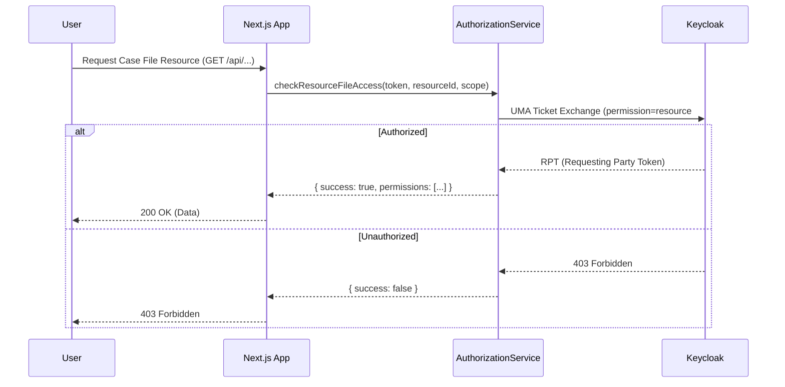
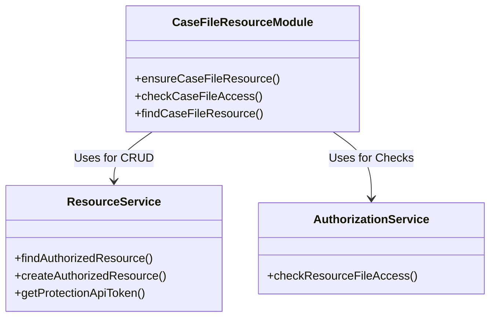

# Case File Authorization with Keycloak

This module implements per-user (case file) authorization for the Title IX Victim Advocacy Platform using Keycloak Authorization Services.

## Overview

Each case file is represented by a `user_id` in the `users` table, and all `document_units` records are linked to a case file via the `user_id` column. Keycloak resources are dynamically created for each case file, enabling fine-grained access control based on ACL attributes.

## Architecture

Authorization is enforced using Keycloak's User-Managed Access (UMA) protocol, abstracted through `AuthorizationService` and `ResourceService`.

### Authorization Flow



### Component Interaction



### Database Schema

- **users table**: Represents case files (one user = one case file)
- **document_units table**: Links documents to case files via `user_id` foreign key
- **accounts table**: Links local users to Keycloak accounts (provider = 'keycloak')

### Keycloak Resources

Each case file has a corresponding Keycloak resource:

```json
{
  "name": "case-file:{userId}",
  "type": "case-file",
  "owner": "{keycloakUserId}",
  "scopes": ["case-file:read", "case-file:write", "case-file:admin"],
  "attributes": {
    "caseFileId": ["{userId}"],
    "readers": ["{keycloakUserId}"],
    "writers": ["{keycloakUserId}"],
    "admins": ["{keycloakUserId}"]
  }
}
```

### Authorization Scopes

- **case-file:read**: View case file documents, emails, and properties
- **case-file:write**: Modify case file documents and emails
- **case-file:admin**: Full administrative access (add/remove users, manage sharing)

---

## Service Usage

This module leverages `AuthorizationService` and `ResourceService` singleton providers.

### 1. Checking Access

> **Note**: Methods like `checkResourceFileAccess` and `getUserEntitlements` support flexible input for credentials. You can pass a raw `bearerToken` string, a `NextRequest` object (which will be checked for an `Authorization` header or session cookie), or `undefined` (which attempts to fallback to the active session).


To check if a user has access to a resource, use the `authorizationService` helper.

```typescript
import { authorizationService } from '@/lib/auth/resources/authorization-service';
import { env } from '@/lib/site-util/env';

const result = await authorizationService(service => service.checkResourceFileAccess({
  resourceId: 'keycloak-resource-uuid',
  scope: 'case-file:read',
  audience: env('AUTH_KEYCLOAK_CLIENT_ID'),
  // bearerToken can be a string, NextRequest, or omitted (resolves from context)
  bearerToken: req 
}));

if (result.success) {
  // Authorized
}
```

### 2. Managing Resources

To find or create resources, use the `resourceService` helper.

```typescript
import { resourceService } from '@/lib/auth/resources/resource-service';

// Find a resource by name
const resource = await resourceService(service => 
  service.findAuthorizedResource('case-file:123')
);

// Create a resource
if (!resource) {
  await resourceService(service => service.createAuthorizedResource({
    name: 'case-file:123',
    type: 'case-file',
    // ... other properties
  }));
}
```

### 3. Retrieving Entitlements

To retrieve all permissions (entitlements) granted to the user by Keycloak, use `getUserEntitlements`. This is useful for listing resources the user has access to without checking them one by one.

```typescript
// 1. Using a bearer token string
const entitlements = await authorizationService(service => 
  service.getUserEntitlements(userAccessToken)
);

// 2. Using NextRequest (extracts token header or session)
const entitlementsFromReq = await authorizationService(service => 
  service.getUserEntitlements(req)
);

// 3. Using implicit context (resolves from Keycloak session)
const entitlementsImplicit = await authorizationService(service => 
  service.getUserEntitlements(undefined)
);

// entitlements is an array of permission objects
// [ { rsid: '...', rsname: '...', scopes: [...] }, ... ]
```

---

## Case File Module API

The `lib/auth/resources/case-file` module provides higher-level abstractions specific to the domain.

### Ensuring a Case File Resource Exists

Automatically finds or creates the Keycloak resource for a given user ID.

```typescript
import { ensureCaseFileResource } from '@/lib/auth/resources/case-file';

const resource = await ensureCaseFileResource(userId, keycloakUserId);
```

### Checking Case File Access directly

High-level check that handles resource lookup and token validation.

```typescript
import { checkCaseFileAccess, CaseFileScope } from '@/lib/auth/resources/case-file';

const canRead = await checkCaseFileAccess(req, userId, CaseFileScope.READ);
```

### Listing Authorized Case Files

To determine which case files a user can access (e.g., to filter a list or checking for global access), use `getAccessibleUserIds`. This internally fetches the user's entitlements and filters them for case file resources.

```typescript
import { getAccessibleUserIds } from '@/lib/auth/resources/case-file';

// 1. Pass a token string
const ids1 = await getAccessibleUserIds(userAccessToken);

// 2. Pass a request object
const ids2 = await getAccessibleUserIds(req);

// 3. No arguments (implicit resolution)
const ids3 = await getAccessibleUserIds();
```

### Middleware Example

Protecting an API route:

```typescript
import { NextResponse } from 'next/server';
import { checkCaseFileAuthorization, CaseFileScope } from '@/lib/auth/resources/case-file';

export const GET = async (req: NextRequest, { params }: { params: Promise<{ id: string }> }) => {
  const { id } = await params;
  
  // Checks token, resolves case file ID, and verifies scope
  const auth = await checkCaseFileAuthorization(req, id, {
    requiredScope: CaseFileScope.READ
  });

  if (!auth.authorized) {
    return auth.response;
  }

  return NextResponse.json({ data: 'Authorized Data' });
};
```

---

## Configuration

The services rely on the following environment variables:

- `AUTH_KEYCLOAK_ISSUER`: Keycloak base URL + realm path
- `AUTH_KEYCLOAK_CLIENT_ID`: Client ID for the application
- `AUTH_KEYCLOAK_CLIENT_SECRET`: Client Secret
- `AUTH_KEYCLOAK_REALM`: Realm name (often derived from issuer)
